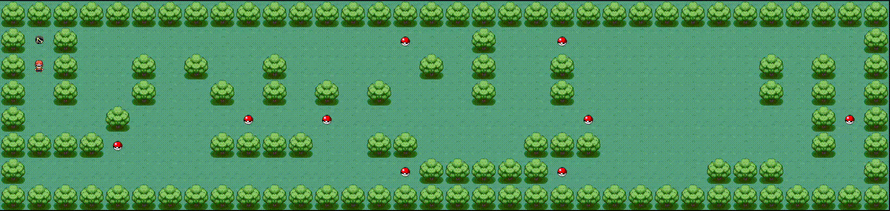

# 42.so_long



## Description

**so_long** is a simple 2D game developed as part of the 42 school curriculum. The player navigates a map, collects all collectibles, and reaches the exit. The game uses the MiniLibX (MLX) graphics library.

## Features
- Move the player using the keyboard.
- Collect all items (`C`) to unlock the exit (`E`).
- Walls (`1`) block movement.
- The game window is generated based on the provided map.

## Getting Started

### Prerequisites
- Linux environment
- `make`, `gcc`
- X11 development libraries (for MLX)

### Build
```bash
make
```

### Run
```bash
./so_long <map_file.ber>
```
Example:
```bash
./so_long maps/map1.ber
```

## Map Format
- Maps are plain text files with the `.ber` extension.
- Each character represents a tile:
  - `1`: Wall
  - `0`: Floor
  - `P`: Player start position (only one allowed)
  - `E`: Exit (at least one required)
  - `C`: Collectible (at least one required)
- The map must be rectangular and surrounded by walls (`1`).

Example:
```
111111
1P0C01
1000E1
111111
```

## Example Maps
See the `maps/` directory for sample maps.

## Controls
- Arrow keys or WASD: Move the player
- ESC: Exit the game
